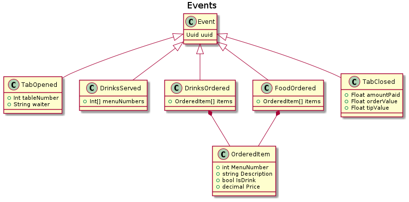

# TDD-App

## Cafe domain

Our focus will be on the concept of a **tab**, which tracks the visit of an individual or group to the cafe.

- When people arrive to the cafe and take a table, a tab is **opened**.
- They may then order drinks and food. **Drinks** are **served** immediately by the table staff, however **food** must be cooked by a chef. Once the chef has **prepared** the food, it can then be **served**.
- During their time at the restaurant, visitors may order extra food or drinks. If they realize they ordered the wrong thing, they may amend the order - but not after the food and drink has been served to and accepted by them.
- Finally, the visitors close the tab by paying what is owed, possibly with a tip for the serving staff. Upon closing a tab, it must be paid for in full. A tab with unserved items cannot be closed unless the items are either marked as served or cancelled first.

## Events

Looking through the scenario, focusing on the language we find within it, we look for things that happen that lead to some kind of new information in the domain.

Here are a set of events we may come up with from the cafe tab scenario.

- TabOpened
- DrinksOrdered
- FoodOrdered
- DrinksCancelled
- FoodCancelled
- DrinksServed
- FoodPrepared
- FoodServed
- TabClosed

## Commands

Commands are things that indicate **requests** to our domain. While an event states that something certainly happened, a commandOpenTab may be accepted or rejected.

- OpenTab
- PlaceOrder
- AmendOrder
- MarkDrinksServed
- MarkFoodPrepared
- MarkFoodServed
- CloseTab

